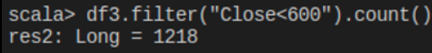
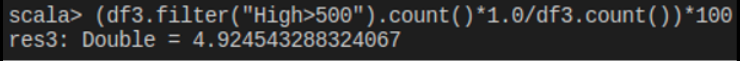
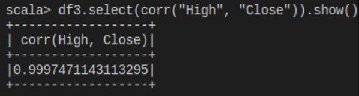
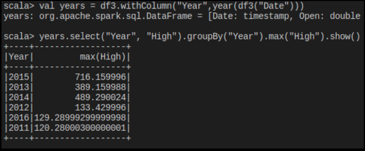
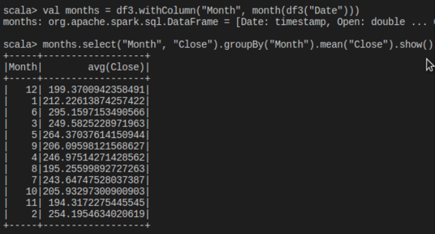

## Test Unit 1

**Introduction**

Next, the results obtained for the exam of unit 1 of the Big Data subject will be presented, where we understand the basic concepts of scale language working in the spark environment.

1.- Start a simple Spark session.

```scala
spark-shell
import org.apache.spark.sql.SparkSession
val spark = SparkSession.builder().getOrCreate()
```

2.- Load the Netflix Stock CSV file, make Spark infer the data types.

```scala
valdf = spark.read.option ("header", "true"). option ("inferSchema", "true"). csv ("Netflix_2011_2016.csv")
```

3.- What are the names of the columns?

```scala
df.columns
```

4.- What is the scheme like?

```scala
df.printSchema ()
```

5.- Print the first 5 columns.

```scala
df.select ($ "Date", $ "Open", $ "High", $ "Low", $ "Close"). show ()
```

6.- Use describe () to learn about the DataFrame.

```scala
df.describe (). show ()
```

7.- Create a new dataframe with a new column called "HV Ratio" which is the relationship between the price of the "High" column versus the "Volume" column of shares traded for a day. (Hint: It is a column operation).

```scala
valdf2 = df.withColumn ("HV Ratio", df ("High") / df ("Volume")
```

8.- What day had the highest peak in the "Close" column?

```scala
df.select ("Date", "Close"). sort (desc ("Close")). show (1)
```

9.- Write in your own words in a comment of your code. What is the meaning of the Close column "Close"?

It refers to what closed in the shares of the day


10.- What is the maximum and minimum of the "Volume" column?

```scala
df.select (max ("Volume")). show ()
df.select (min ("Volume")). show ()
```

11.With Scala / Spark $ syntax answer the following:

Hint: Basically very similar to the dates session, you will have to create another dataframe to answer some of the items.

11a.- How many days was the column "Close" less than 600?

```scala
df.filter ($ "Close" <600) .count ()
```
The result is this:



11b.- What percentage of the time was the column "High" greater than $ 500?

```scala
(df.filter($"High">500).count()*1.0/df.count())*100
```

The result is this:



11c.- What is the Pearson correlation between the "High" column and the "Volume" column?

```scala
df.select (corr ("High", "Volume")). show ()
```

The result is this:



11d.- What is the maximum of the "High" column per year?

```scala
valyeardf = df.withColumn ("Year", year (df ("Date"))) valyearmaxs = yeardf.select ($ "Year", $ "High"). groupBy ("Year"). max () yearmaxs.select ($ "Year", $ "max (High)"). Show ()
```

The result is this:



11e.- ¿Cuál es el promedio de columna "Close" para cada mes del calendario?

```scala
valmonthdf = df.withColumn("Month",month(df("Date")))valmonthavgs =monthdf.select($"Month",$"Close").groupBy("Month").mean()monthavgs.select($"Month",$"avg(Close)").show()
```

The result is this:

