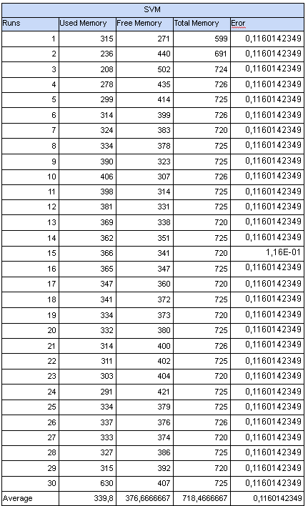
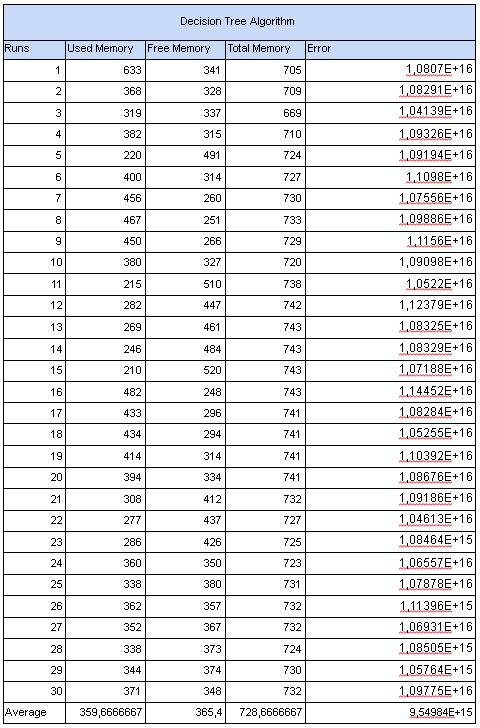

## Instituto Tecnológico de Tijuana

**SUBDIRECCIÓN ACADÉMICA**

**DEPARTAMENTO DE SISTEMAS Y COMPUTACIÓN**

**MATERIA**
**BDD-1704SC9A – DATOS MASIVOS** 

DOCENTE
MC JOSE CHRISTIAN ROMERO HERNANDEZ

Final Project

ALUMNOS:                        
JONATHAN GONZALEZ ROSALES 17210570

# Index

## [1.- Introduction](#Introduction)
## [2.- Develoment](#Develoment)
   #### [SVM](#SVM)
   #### [Decision Tree](#DecisionTree)
   #### [Logistic Regression](#LogisticRegression)
   #### [Multilayer Perceptron](#MultilayerPerceptron)
## [3.- Implementation](#Implementation)
## [4.- Results](#Results)
## [5.- Conclusion](#Conclusion)
## [6.- References](#References)

# 1.- Introduction

Machine learning is an application of artificial intelligence (AI) that provides systems the ability to automatically learn and improve from experience without being explicitly programmed. Machine learning focuses on the development of computer programs that can access data and use it to learn for themselves.
The process of learning begins with observations or data, such as examples, direct experience, or instruction, in order to look for patterns in data and make better decisions in the future based on the examples that we provide. 

There are different types of algorithms and these are applicable depending on the type of machine learning in which the algorithm will work. Among them there are the algorithms of: regression, Bayesian, grouping, neural networks, among others. Below we will see some machine learning algorithms and their implementation in a data set.

# 2.- Develoment

### 2.1 Support Vector Machine

Support Vector Machines constitute a learning-based method for solving classification and regression problems. In both cases, this resolution is based on a first training phase (where they are informed with multiple examples already solved, in the form of pairs {problem, solution}) and a second phase of use for problem solving. In it, SVMs become a "black box" that provides an answer (output) to a given problem (input).

The objective of the SVM (support vector machine) algorithm is to find a hyperplane in an N-dimensional space(N - the number of features) that distinctly classifies the data points.

Hyperplanes are decision boundaries that help classify the data points. Data points falling on either side of the hyperplane can be attributed to different classes. Also, the dimension of the hyperplane depends upon the number of features. If the number of input features is 2, then the hyperplane is just a line. If the number of input features is 3, then the hyperplane becomes a two-dimensional plane. It becomes difficult to imagine when the number of features exceeds 3. 

Support vectors are data points that are closer to the hyperplane and influence the position and orientation of the hyperplane. Using these support vectors, we maximize the margin of the classifier. Deleting the support vectors will change the position of the hyperplane. These are the points that help us build our SVM.

### 2.2 Decision Tree

A decision tree is a prediction model whose main objective is inductive learning from observations and logical constructions. They are very similar to rule-based prediction systems, which serve to represent and categorize a series of conditions that occur successively for the solution of a problem. They are probably the most widely used and popular classification model. The knowledge obtained during the inductive learning process is represented by a tree.

A tree is graphically represented by a set of nodes, leaves, and branches. The main or root node is the attribute from which the classification process starts; the inner nodes correspond to each of the questions about the particular attribute of the problem. Each possible answer to the questions is represented by a child node. The branches that come out of each of these nodes are labeled with the possible values of attribute 2. 

The final nodes or leaf nodes correspond to a decision, which coincides with one of the class variables of the problem to be solved. This model is built from the narrative description of a problem, since it provides a graphic vision of decision making, specifying the variables that are evaluated, the actions that must be taken and the order in which the decision making will be carried out. Each time this type of model is executed, only one path will be followed depending on the current value of the evaluated variable. The values that the variables can take for this type of model can be discrete or continuous.

A decision tree is a prediction model whose main objective is inductive learning from observations and logical constructions. They are very similar to the systems of A decision tree generation algorithm consisting of 2 stages: the first corresponds to the induction of the tree and the second to the classification. In the first stage, the decision tree is built from the training set; Usually each internal node of the tree is made up of a test attribute and the portion of the training set present in the node is divided according to the values that this attribute can take. 

Building the tree begins by generating its root node, choosing a test attribute, and dividing the training set into two or more subsets; a new node is generated for each partition and so on. When there are objects of more than one class in a node, an internal node is generated; when it contains objects of only one class, a sheet is formed that is assigned the label of the class. In the second stage of the algorithm each new object is classified by the built tree; then the tree is traversed from the root node to a leaf, from which the membership of the object to some class is determined. The path to follow in the tree is determined by the decisions made at each internal node, according to the test attribute present in it.

# 3.- Implementation

#### What is Spark?

Spark is an open source platform widely used in the industry for the processing of large volumes of data and execution of intensive computation on them. A framework that offers great value transforming and analyzing relevant data that helps large companies make better business decisions.

This platform contains modules and libraries to better work with the data to be processed. In addition, Spark is multilanguage so it can be programmed in Scala, Python, Java or R.

#### Why use Spark?

Apache Spark is a distributed data processing framework designed to be fast, and is classified as general purpose. It consists of different APIs and modules that allow it to be used by a wide variety of professionals at all stages of the data life cycle.

#### Why code in Spark with Scala?

Scalable language (Scala), is a hybrid language between object-oriented programming and functional programming. Therefore, having the advantages of one and the other, it is a quite functional and practical language.

It has less code to perform some functions compared to other languages. This is useful because you can reduce your code to a minimum and thus read it faster to correct potential problems.

In addition, it is compatible with the Java virtual machine, this means that you can reuse Java libraries in your Scala applications, you will have compatibility with Java code and you can benefit from a consolidated community in the programming scene.

# 4.- Results 

